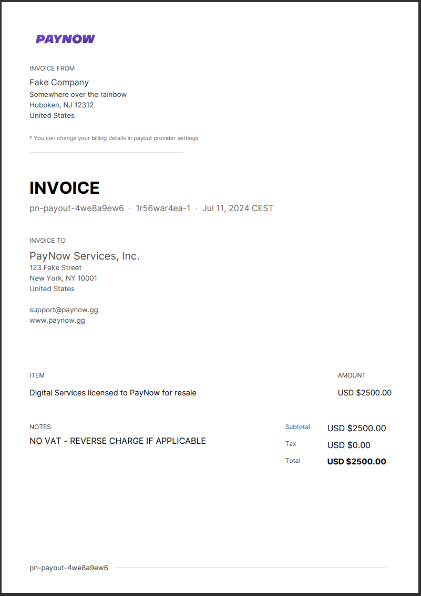

# Go PDF Invoice Generator

This repository is a modified version of the original [invoice](https://github.com/maaslalani/invoice), featuring extended functionality and support for use as a Go module.

## Features

- **Module Support**: Easily integrate the invoice generator into your Go projects.
- **Enhanced Customization**: More options for customizing the appearance and content of invoices.
- **Multi-language Support**: Generate invoices in multiple languages.
- **Flexible Currency Handling**: Improved currency formatting and handling.
- **Additional Payment Methods**: Support for more payment methods.
- **Extended Metadata**: Include more detailed metadata in your invoices.
- **Optimized for Performance**: Improved performance and reduced dependencies.

## Installation

To install the module, use:

```bash
go get github.com/m0uka/golang-pdf-invoice-generator
```

Import it in your Go project:

```go
import "github.com/m0uka/golang-pdf-invoice-generator/invoicepdf"
```

## Usage

### Basic Example

Here is a basic example of how to generate an invoice:

```go
package main

import (
    "log"
    "github.com/m0uka/golang-pdf-invoice-generator/invoicepdf"
    "os"
    "bytes"
)

func main() {
    invoice := invoicepdf.Invoice{
        Id:     "12345",
        Number: "INV-1001",
        Title:  "Invoice Title",
        LogoUrl: "http://example.com/logo.png",
        From: invoicepdf.InvoiceCompany{
            Name:         "Your Company Name",
            AddressLine1: "Your Company Address Line 1",
            AddressLine2: "Your Company Address Line 2",
            City:         "Your City",
            Country:      "Your Country",
            State:        "Your State",
            PostalCode:   "123456",
            TaxID:        "TAX123456",
            Email:        "info@yourcompany.com",
            Website:      "https://yourcompany.com",
        },
        To: invoicepdf.InvoiceCompany{
            Name:         "Customer Name",
            AddressLine1: "Customer Address Line 1",
            AddressLine2: "Customer Address Line 2",
            City:         "Customer City",
            Country:      "Customer Country",
            State:        "Customer State",
            PostalCode:   "654321",
            TaxID:        "CUST123456",
            Email:        "customer@example.com",
            Website:      "https://customerwebsite.com",
        },
        Date:       "2024-07-11",
        Due:        "2024-07-25",
        Items:      []string{"Product 1", "Product 2"},
        Quantities: []int{2, 1},
        Rates:      []float64{50.0, 75.0},
        Tax:        10.0,
        Discount:   5.0,
        Currency:   "USD",
        Note:       "Thank you for your business.",
        HeaderNote: "Invoice Header Note",
    }

    buffer, err := invoicepdf.GenerateInvoice(&invoice)
    if err != nil {
        log.Fatalf("Could not generate invoice: %v", err)
    }

    // Save buffer to file or handle it as needed
    err = saveBufferToFile(buffer, "invoice.pdf")
    if err != nil {
        log.Fatalf("Could not save invoice: %v", err)
    }
}

func saveBufferToFile(buffer *bytes.Buffer, filename string) error {
    return os.WriteFile(filename, buffer.Bytes(), 0644)
}
```

### Example Output



## License

This project is licensed under the MIT License. See the [LICENSE](LICENSE) file for details.